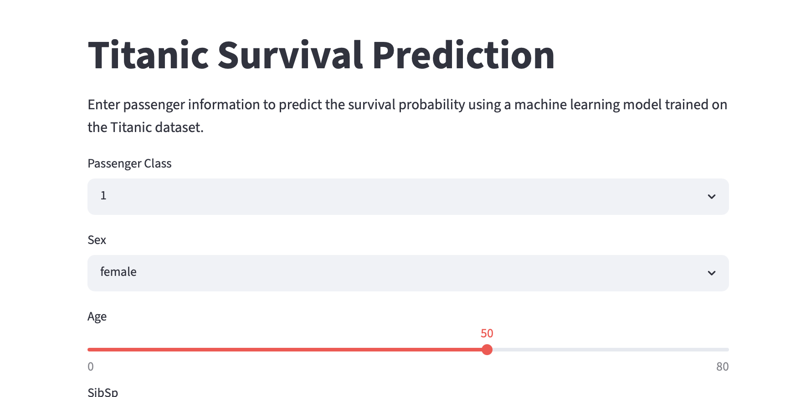
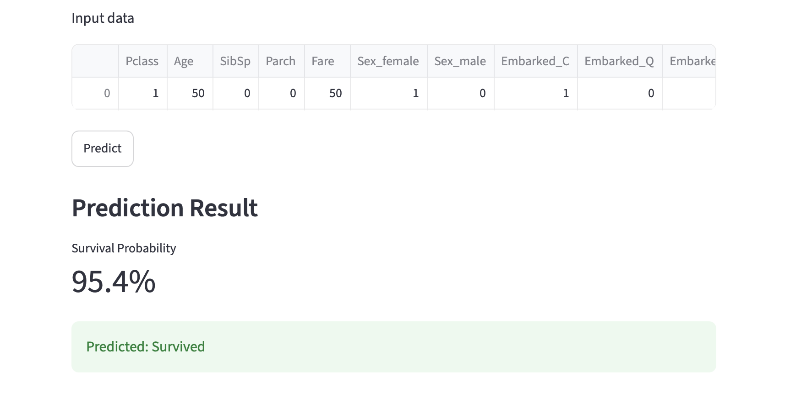
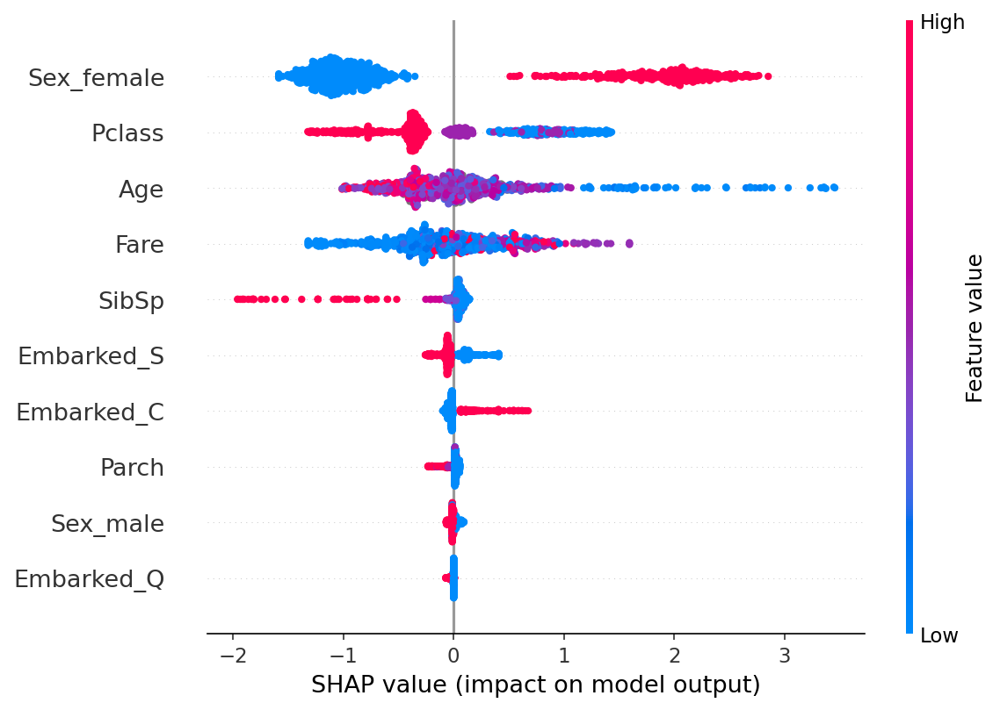
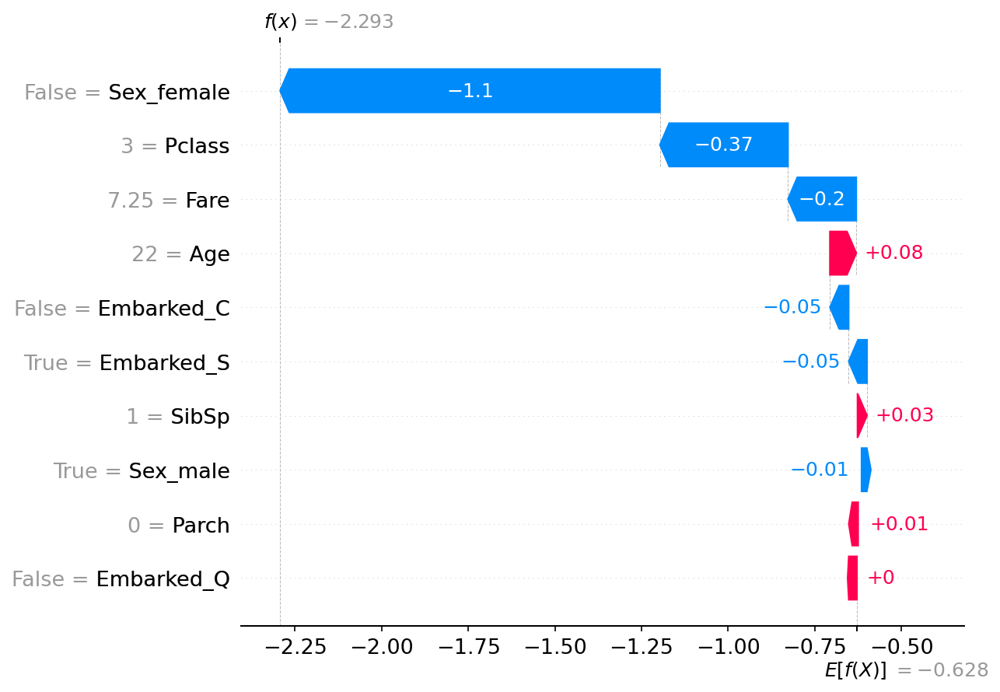

# Titanic Survival Prediction App

A machine learning web application that predicts the survival probability of Titanic passengers based on their characteristics.

## Live Demo

https://titanic-survival-app-zzlvm5mih3zbsemrrgry3n.streamlit.app

## Application
<p align="center">

</p>
<p align="center">

</p>
## Overview

This application uses a LightGBM classifier trained on the Kaggle Titanic dataset to estimate the probability that a passenger would survive.

Users can input passenger information such as:

- Passenger class
- Sex
- Age
- Number of siblings/spouses aboard
- Number of parents/children aboard
- Fare
- Port of embarkation

The model then outputs the predicted survival probability.

## Features

- Interactive web interface built with Streamlit
- Probability prediction using LightGBM
- Real-time inference
- Deployed online with Streamlit Community Cloud

## Model Explainability

### SHAP Summary Plot
<!--  -->
<p align="center">
  
</p>
The summary plot illustrates the global importance of each feature and how they influence survival predictions.

### SHAP Waterfall Plot
<p align="center">
  
</p>
The waterfall plot provides a local explanation for an individual prediction, showing how each feature contributes to the final prediction.

## Technologies Used

- Python
- Pandas
- NumPy
- Scikit-learn
- LightGBM
- Joblib
- Streamlit

## Project Structure

```
titanic-survival-app/
│
├── app.py
├── titanic_model.pkl
├── titanic_columns.pkl
├── requirements.txt
├── README.md
├── images/
│   ├── shap_summary.png
│   └── shap_waterfall.png
└── .gitignore
```

## Dataset

- Kaggle Titanic - Machine Learning from Disaster

https://www.kaggle.com/competitions/titanic

## Model

- Model: LightGBM Classifier
- Output: Survival probability
- Classification threshold: 0.5

## Future Improvements

- Better UI design
- Docker support
- Additional models for comparison
